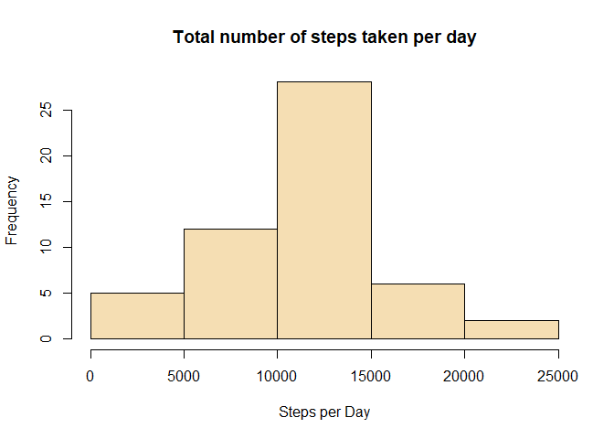
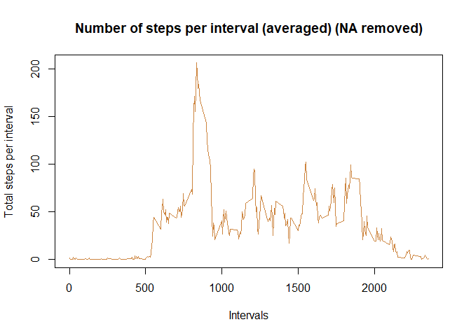
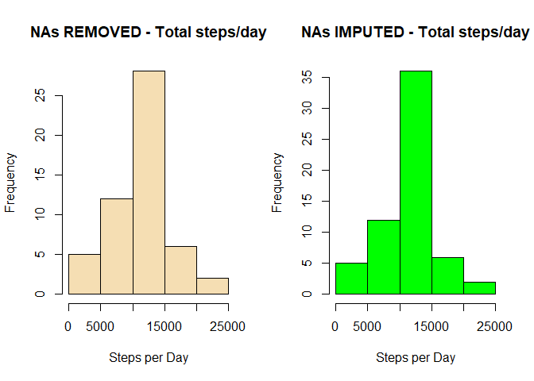
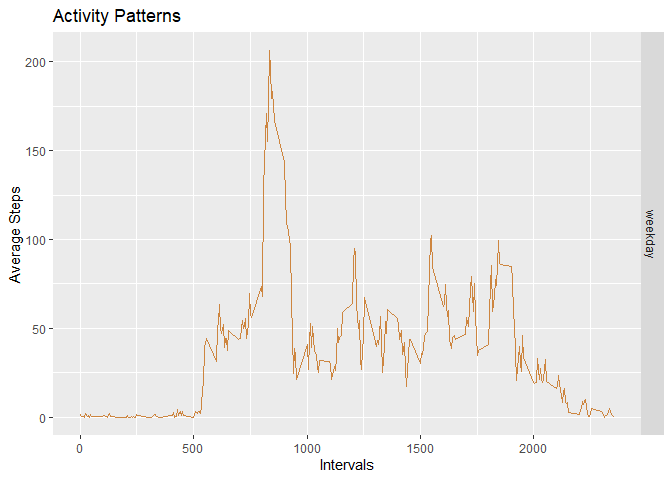

##load data

```r
activity <- read.csv("activity.csv",header=T,sep=",")
```

##We use the aggregate function, removing NAs, and draw the histogram with base plotting:

```r
activity_steps_day <- aggregate(steps ~ date, data = activity, FUN = sum, na.rm = TRUE)
```
##Histogram of the total number of steps taken each day.


```r
hist(activity_steps_day$steps, xlab = "Steps per Day", main = "Total number of steps taken per day", col = "wheat")
```

<!-- -->
##Mean and median of the total number of steps taken per day

```r
mean_steps <- mean(activity_steps_day$steps)
median_steps <- median(activity_steps_day$steps)
mean_steps <- format(mean_steps,digits=1)
median_steps <- format(median_steps,digits=1)
```
##Time series plot of the 5-minute interval (x-axis) and the average number of steps taken, averaged across all days (y-axis)

```r
activity_steps_mean <- aggregate(steps ~ interval, data = activity, FUN = mean, na.rm = TRUE)
#Plot
plot(activity_steps_mean$interval, activity_steps_mean$steps, type = "l", col = "tan3", xlab = "Intervals", ylab = "Total steps per interval", main = "Number of steps per interval (averaged) (NA removed)")
```

<!-- -->


## Which 5-minute interval, on average across all the days in the dataset, contains the maximum number of steps?

```r
max_steps <-max(activity_steps_mean$steps)
max_interval <- activity_steps_mean$interval[which(activity_steps_mean$steps == max_steps)]
max_steps <- round(max_steps, digits = 2)
```


##Calculate total number of missing values in the dataset.

```r
sum(is.na(activity))
```

```
## [1] 2304
```

## Create new dataset with the missing data filled 

```r
MeanStepsPerInterval <- tapply(activity$steps, activity$interval, mean, na.rm = TRUE)
activity_NAs <- activity[is.na(activity$steps),]
activity_non_NAs <- activity[!is.na(activity$steps),]
activity_NAs$steps <- as.factor(activity_NAs$interval)
levels(activity_NAs$steps) <- MeanStepsPerInterval
levels(activity_NAs$steps) <- round(as.numeric(levels(activity_NAs$steps)))
activity_NAs$steps <- as.integer(as.vector(activity_NAs$steps))
imputed_activity <- rbind(activity_NAs, activity_non_NAs)
```


##Make a histogram of the total number of steps taken each day

```r
par(mfrow = c(1,2))
activity_steps_day <- aggregate(steps ~ date, data = activity, FUN = sum, na.rm = TRUE)
hist(activity_steps_day$steps, xlab = "Steps per Day", main = "NAs REMOVED - Total steps/day", col = "wheat")
imp_activity_steps_day <- aggregate(steps ~ date, data = imputed_activity, FUN = sum, na.rm = TRUE)
hist(imp_activity_steps_day$steps, xlab = "Steps per Day", main = "NAs IMPUTED - Total steps/day", col = "green")
```

<!-- -->


##We calculate like previously the mean and median values, and store the new and old results in a data frame for easier comparison:

```r
imp_mean_steps <- mean(imp_activity_steps_day$steps)
imp_median_steps <- median(imp_activity_steps_day$steps)
imp_mean_steps <- format(imp_mean_steps,digits=1)
imp_median_steps <- format(imp_median_steps,digits=1)
results_mean_median <- data.frame(c(mean_steps, median_steps), c(imp_mean_steps, imp_median_steps))
colnames(results_mean_median) <- c("NA removed", "Imputed NA values")
rownames(results_mean_median) <- c("mean", "median")
```

##Are there differences in activity patterns between weekdays and weekends?

```r
imputed_activity$dayType <- ifelse(weekdays(as.Date(imputed_activity$date)) == "Samstag" | weekdays(as.Date(imputed_activity$date)) == "Sonntag", "weekend", "weekday")
imputed_activity$dayType <- factor(imputed_activity$dayType)
```


##Panel plot containing time series plot


```r
steps_interval_dayType <- aggregate(steps ~ interval + dayType, data = imputed_activity, FUN = mean)
head(steps_interval_dayType)
```

```
##   interval dayType      steps
## 1        0 weekday 1.75409836
## 2        5 weekday 0.29508197
## 3       10 weekday 0.11475410
## 4       15 weekday 0.13114754
## 5       20 weekday 0.06557377
## 6       25 weekday 2.08196721
```


#add descriptive variables

```r
names(steps_interval_dayType) <- c("interval", "day_type", "mean_steps")
```
#plot with ggplot2

```r
library(ggplot2)
```

```
## Warning: package 'ggplot2' was built under R version 4.0.2
```

```r
plot <- ggplot(steps_interval_dayType, aes(interval, mean_steps))
plot + geom_line(color = "tan3") + facet_grid(day_type~.) + labs(x = "Intervals", y = "Average Steps", title = "Activity Patterns")
```

<!-- -->


